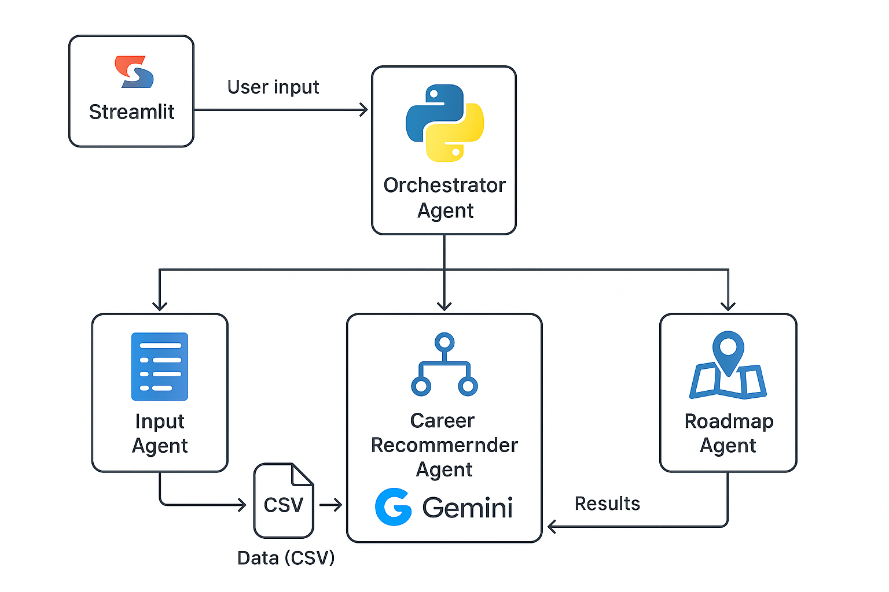

# 🎓 Career Counseling Assistant using Multi-Agent Architecture

This is an AI-powered career counseling app built using **Google's Gemini AI**, deployed with **Streamlit**, and enhanced with multi-agent architecture for a complete interactive experience.

🔗 **Live Demo**: [career-counseling-adk.streamlit.app](https://career-counseling-adk.streamlit.app/)

---

## 🧠 Features

- 🔍 Personalized career recommendations based on interest, strength, and GPA.
- 🤖 Multi-agent architecture: InputAgent, CareerRecommenderAgent, ExplainerAgent, RoadmapAgent.
- 📄 CSV-based data-driven decision logic (no ML used).
- 🧭 Career explanation and roadmap guidance using LLMs.
- 🌐 Hosted publicly via Streamlit Cloud.

---

## 🏗️ Architecture



---

## 🚀 How It Works

1. User enters details: Name, Interests, Strengths, GPA.
2. `InputAgent` collects and validates data.
3. `CareerRecommenderAgent` matches CSV-based careers.
4. `ExplainerAgent` provides reasoning using Gemini / LLM.
5. `RoadmapAgent` outlines the path forward.

---

## 🛠️ Setup Instructions

### Prerequisites
- Python 3.8 or higher
- Google Gemini API key

### Installation

1. **Clone the repository**
   ```bash
   git clone https://github.com/your-username/career-counseling-adk.git
   cd career-counseling-adk
   ```

2. **Install dependencies**
   ```bash
   pip install -r requirements.txt
   ```

3. **Set up environment variables**
   - Create a `.env` file in the project root
   - Add your Gemini API key:
     ```
     GEMINI_API_KEY=your_api_key_here
     ```
   - Get your free API key from [Google AI Studio](https://makersuite.google.com/app/apikey)

4. **Run the application**
   ```bash
   streamlit run app.py
   ```

### Deployment on Streamlit Cloud

1. Push your code to GitHub
2. Connect your repository to [Streamlit Cloud](https://streamlit.io/cloud)
3. Add your `GEMINI_API_KEY` as a secret in Streamlit Cloud settings
4. Deploy!

---

## 💡 Technologies Used

- Python
- Google Gemini AI
- Streamlit
- CSV (Data Store)

---

## 📁 Directory Structure

career-counseling-adk/
│
├── agents/
│ ├── input_agent.py
│ ├── career_agent.py
│ ├── explainer_agent.py
│ └── roadmap_agent.py
│
├── data/
│ └── career_data.csv
│
├── app.py
├── config.py
├── requirements.txt
├── architecture.png
└── README.md

## 🙋 Author

- **Name**: Mamidala Aravind
- **GitHub**: [@Aravind-Mamidala](https://github.com/Aravind-Mamidala)

---

## 📢 Submission Info

- 🔧 Hackathon: [Agent Development Kit Hackathon with Google Cloud](https://devpost.com/)
- 💡 Category: Career Counseling using Multi-Agent Systems
- 🤖 AI: Gemini Pro (via Explainer/Roadmap Agents)

---
